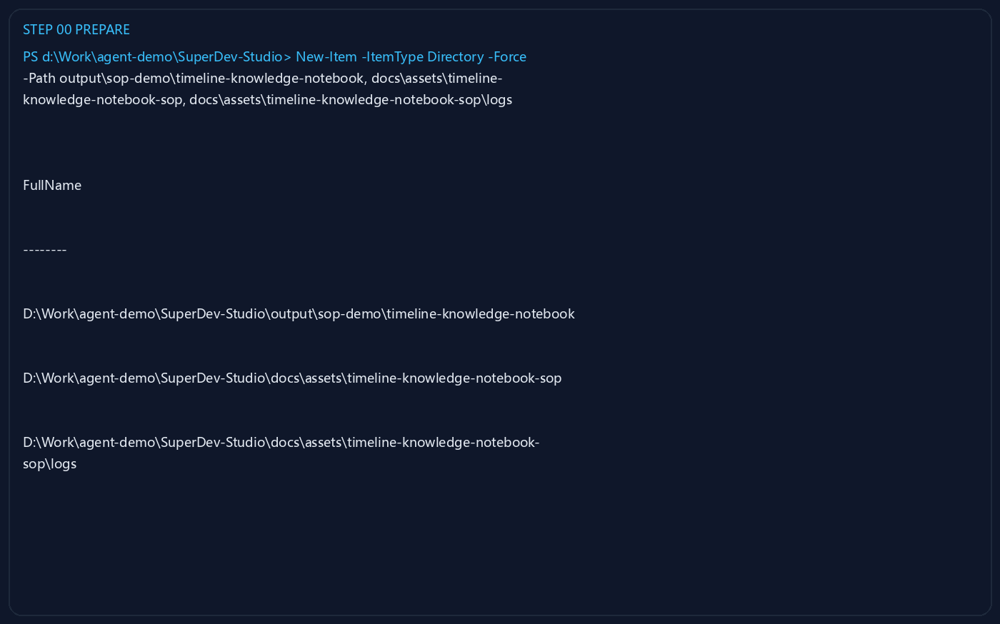
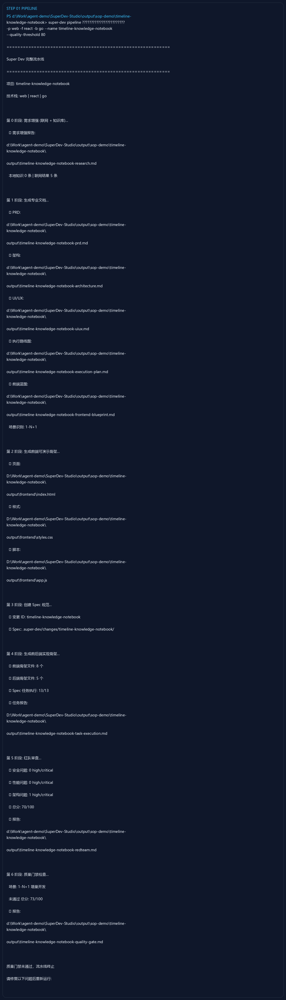
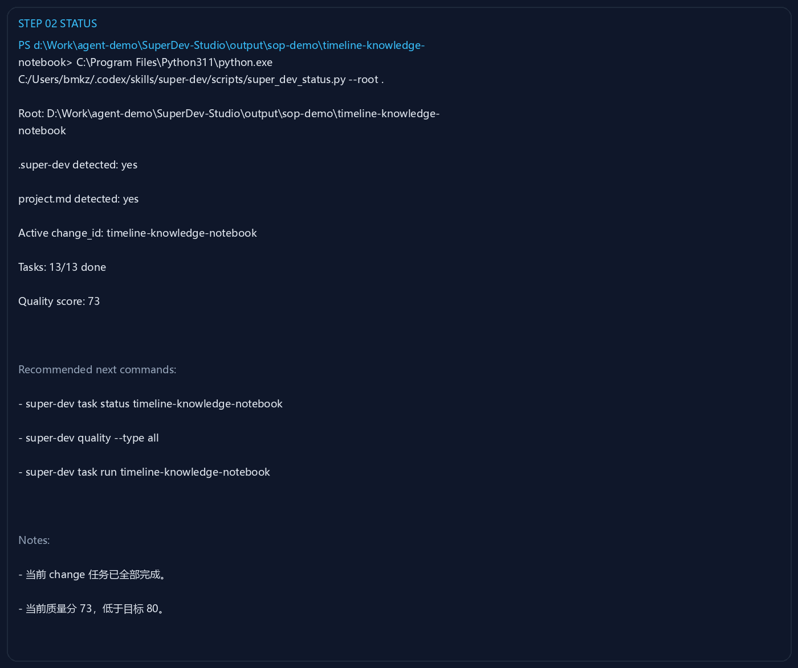
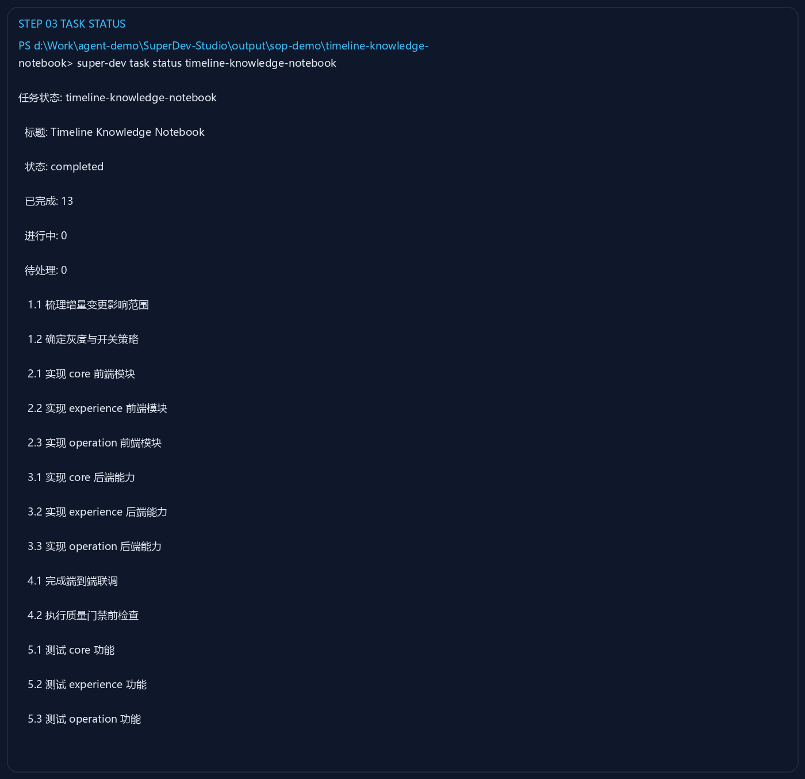
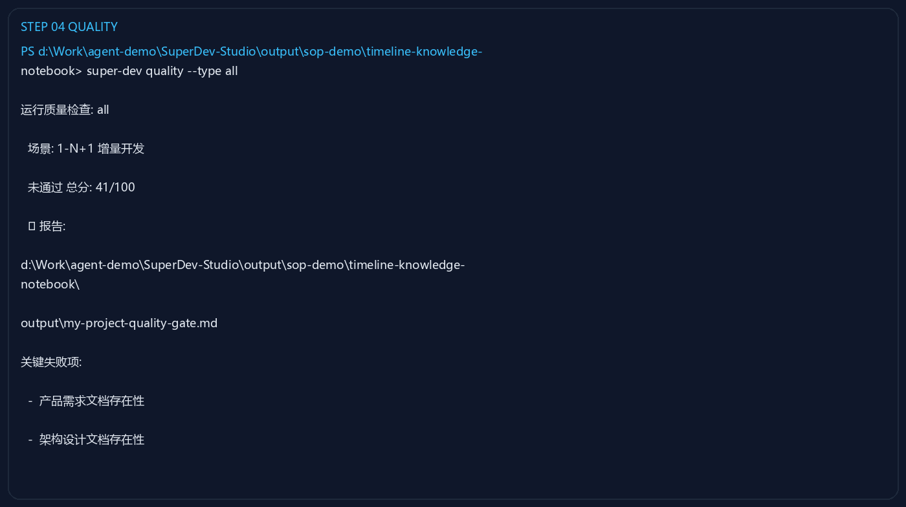
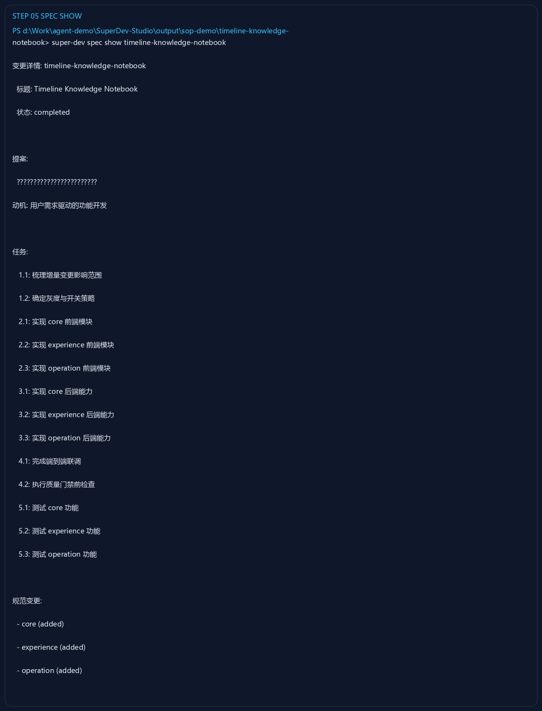
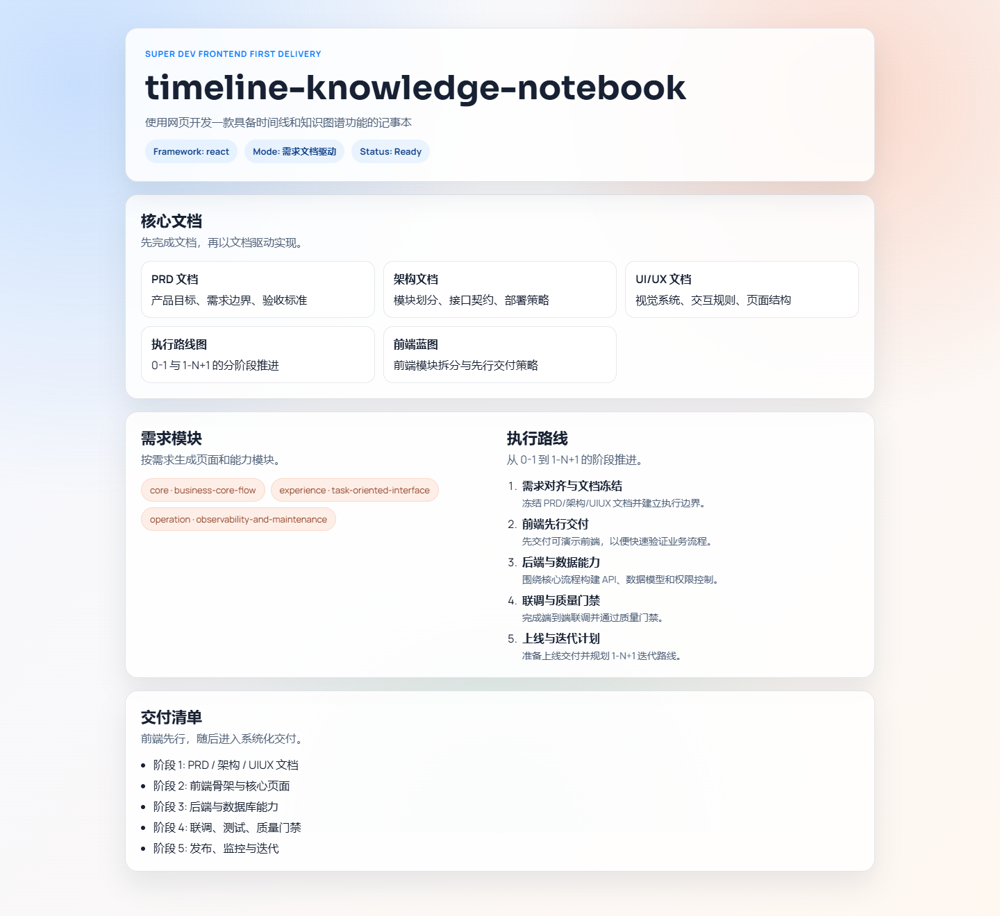

# Super Dev SOP：以“使用网页开发一款具备时间线和知识图谱功能的记事本”为主题执行一轮网页开发流程

## 1. 目标与范围

本文档记录一次**实际执行过**的 Super Dev 流程，主题为：

> 使用网页开发一款具备时间线和知识图谱功能的记事本

本次 SOP 采用**隔离演示目录**执行，避免污染现有主工程：

- 演示目录：`output/sop-demo/timeline-knowledge-notebook`
- 文档截图目录：`docs/assets/timeline-knowledge-notebook-sop`
- 流程方式：`super-dev pipeline` + 状态复核 + 任务复核 + 质量复核 + 页面预览

## 2. 本次实际运行结果摘要

本次实跑已经完成以下事项：

- 已创建独立演示工作区：`output/sop-demo/timeline-knowledge-notebook`
- 已执行完整流水线：研究、PRD、架构、UI/UX、执行计划、前端蓝图、Spec、前后端骨架、红队审查、质量门禁
- 已生成变更：`timeline-knowledge-notebook`
- 已完成任务：`13/13`
- 已生成静态预览页面，并完成浏览器截图

本次实跑的关键结论：

- 流水线内置质量门禁结果：`73/100`，**未通过**
- 红队审查结果：`70/100`
- 当前流程已经能够从一句主题描述生成完整交付骨架，但**还不能算最终验收通过**

## 3. 建议的标准执行方式

对于已有工程，推荐采用以下顺序：

1. 先创建隔离目录或新分支，避免直接污染主工程
2. 运行 `super-dev pipeline` 生成完整产物
3. 使用 `super_dev_status.py` 查看当前 change 与质量得分
4. 使用 `super-dev task status <change_id>` 检查任务闭环
5. 使用 `super-dev spec show <change_id>` 复核 proposal / spec / tasks
6. 预览生成的页面或骨架，确认主题是否正确落到界面
7. 若质量门禁未通过，进入修复循环后重新执行质量检查

---

## 4. 详细操作步骤（含截图）

### Step 0：准备隔离演示目录

**目的**

- 在仓库内创建一块独立演示区域，专门用于本次主题流程演示
- 将截图和日志也统一收敛到 `docs/assets` 下，方便后续整理 SOP

**执行命令**

```powershell
New-Item -ItemType Directory -Force -Path \
  output\sop-demo\timeline-knowledge-notebook, \
  docs\assets\timeline-knowledge-notebook-sop, \
  docs\assets\timeline-knowledge-notebook-sop\logs
```

**操作截图**



**完成标准**

- 存在 `output/sop-demo/timeline-knowledge-notebook`
- 存在 `docs/assets/timeline-knowledge-notebook-sop`
- 后续所有运行日志和截图都能集中落盘

### Step 1：运行完整 Super Dev 流水线

**目的**

- 以一句主题描述直接驱动完整交付流程
- 一次性产出研究、文档、Spec、骨架、审查与质量门禁报告

**执行命令**

```powershell
cd output\sop-demo\timeline-knowledge-notebook
super-dev pipeline "使用网页开发一款具备时间线和知识图谱功能的记事本" -p web -f react -b go --name timeline-knowledge-notebook --quality-threshold 80
```

**操作截图**



**本步实际结果**

- 已生成研究报告：`output/sop-demo/timeline-knowledge-notebook/output/timeline-knowledge-notebook-research.md`
- 已生成 PRD：`output/sop-demo/timeline-knowledge-notebook/output/timeline-knowledge-notebook-prd.md`
- 已生成架构文档：`output/sop-demo/timeline-knowledge-notebook/output/timeline-knowledge-notebook-architecture.md`
- 已生成 UI/UX 文档：`output/sop-demo/timeline-knowledge-notebook/output/timeline-knowledge-notebook-uiux.md`
- 已生成执行计划：`output/sop-demo/timeline-knowledge-notebook/output/timeline-knowledge-notebook-execution-plan.md`
- 已生成前端蓝图：`output/sop-demo/timeline-knowledge-notebook/output/timeline-knowledge-notebook-frontend-blueprint.md`
- 已创建变更：`output/sop-demo/timeline-knowledge-notebook/.super-dev/changes/timeline-knowledge-notebook`
- 已生成前后端实现骨架
- 已产出红队报告：`output/sop-demo/timeline-knowledge-notebook/output/timeline-knowledge-notebook-redteam.md`
- 已产出质量门禁报告：`output/sop-demo/timeline-knowledge-notebook/output/timeline-knowledge-notebook-quality-gate.md`

**本步结论**

- 流水线可以完整跑通
- 但质量门禁得分仅为 `73/100`，未达到阈值 `80`
- 因此本次流程的状态是：**已生成完整交付骨架，但需要继续进入修复闭环**

### Step 2：检查当前 change 状态

**目的**

- 确认当前目录是否已形成标准 `.super-dev` 工作区
- 快速确认 active change、任务完成度和质量分

**执行命令**

```powershell
python "C:/Users/bmkz/.codex/skills/super-dev/scripts/super_dev_status.py" --root .
```

**操作截图**



**本步实际结果**

- 已识别 `.super-dev`
- 已识别 `project.md`
- Active change：`timeline-knowledge-notebook`
- Tasks：`13/13 done`
- Quality score：`73`

**本步结论**

说明这次主题流程已经完成了 Spec 与任务闭环，但仍需进入质量修复阶段。

### Step 3：检查任务闭环状态

**目的**

- 复核本次 change 下的任务是否全部完成
- 明确任务模块划分是否符合“文档 -> 前端 -> 后端 -> 联调 -> 测试”的推进逻辑

**执行命令**

```powershell
super-dev task status timeline-knowledge-notebook
```

**操作截图**



**本步实际结果**

- 标题：`Timeline Knowledge Notebook`
- 状态：`completed`
- 已完成任务：`13`
- 待处理任务：`0`

任务覆盖了：

- 需求与文档冻结
- 前后端接口草案
- core / experience / operation 三类模块实现
- 联调
- 质量门禁前检查
- 测试验证

**本步结论**

从任务闭环角度，这次主题流程已经走到“可以进入质量修复和最终验收”的阶段。

### Step 4：执行独立质量检查复核

**目的**

- 在流水线之外，单独执行质量命令复核结果
- 验证后续修复循环时应使用的检查命令

**执行命令**

```powershell
super-dev quality --type all
```

**操作截图**



**本步实际结果**

- 独立质量检查额外生成了：`output/sop-demo/timeline-knowledge-notebook/output/my-project-quality-gate.md`
- 这次独立复核的结果为：`41/100`

**重要说明**

本次演示里，**流水线内质量门禁**与**独立 `quality` 命令**的结果并不一致：

- 流水线内门禁：`73/100`
- 独立 `quality` 命令：`41/100`

从本次实跑现象看，独立质量检查更像是按通用项目名 `my-project` 做了一次补充扫描，因此对文档定位不如流水线内置门禁准确。**就本次主题演示而言，应优先以流水线生成的质量报告作为主结论**，同时将独立 `quality` 命令视为一个“需要进一步校准”的复核入口。

### Step 5：查看 Spec 与 Proposal 详情

**目的**

- 确认这次主题描述已经落成 proposal、tasks 和 specs
- 验证 change 的结构是否符合后续多人协作或 AI 协作要求

**执行命令**

```powershell
super-dev spec show timeline-knowledge-notebook
```

**操作截图**



**本步实际结果**

已确认该 change 下存在：

- Proposal：`output/sop-demo/timeline-knowledge-notebook/.super-dev/changes/timeline-knowledge-notebook/proposal.md`
- Tasks：`output/sop-demo/timeline-knowledge-notebook/.super-dev/changes/timeline-knowledge-notebook/tasks.md`
- Specs：
  - `output/sop-demo/timeline-knowledge-notebook/.super-dev/changes/timeline-knowledge-notebook/specs/core/spec.md`
  - `output/sop-demo/timeline-knowledge-notebook/.super-dev/changes/timeline-knowledge-notebook/specs/experience/spec.md`
  - `output/sop-demo/timeline-knowledge-notebook/.super-dev/changes/timeline-knowledge-notebook/specs/operation/spec.md`

**本步结论**

这说明主题需求已经被拆成可持续推进的 change 结构，而不只是一次性文档输出。

### Step 6：启动本地静态服务并预览页面

**目的**

- 直观看到这次主题流程生成的前端预览骨架
- 验证“时间线 + 知识图谱记事本”的主题是否被正确落到页面信息结构上

**执行命令**

```powershell
cd output\sop-demo\timeline-knowledge-notebook\output\frontend
python -m http.server 8777 --bind 127.0.0.1
```

浏览器访问：

```text
http://127.0.0.1:8777/
```

**操作截图**



**本步实际结果**

页面已经展示出以下信息结构：

- 产品标题：`timeline-knowledge-notebook`
- 主题摘要：`使用网页开发一款具备时间线和知识图谱功能的记事本`
- 核心文档入口
- 需求模块区块
- 执行路线区块
- 交付清单区块

**本步结论**

虽然这还不是完整业务产品，但已经形成了一个可预览、可继续扩展的前端交付起点。

---

## 5. 本次流程落盘产物清单

### 5.1 演示工程目录

- `output/sop-demo/timeline-knowledge-notebook/super-dev.yaml`
- `output/sop-demo/timeline-knowledge-notebook/.super-dev/changes/timeline-knowledge-notebook`
- `output/sop-demo/timeline-knowledge-notebook/frontend`
- `output/sop-demo/timeline-knowledge-notebook/backend`
- `output/sop-demo/timeline-knowledge-notebook/output`

### 5.2 关键文档

- `output/sop-demo/timeline-knowledge-notebook/output/timeline-knowledge-notebook-research.md`
- `output/sop-demo/timeline-knowledge-notebook/output/timeline-knowledge-notebook-prd.md`
- `output/sop-demo/timeline-knowledge-notebook/output/timeline-knowledge-notebook-architecture.md`
- `output/sop-demo/timeline-knowledge-notebook/output/timeline-knowledge-notebook-uiux.md`
- `output/sop-demo/timeline-knowledge-notebook/output/timeline-knowledge-notebook-execution-plan.md`
- `output/sop-demo/timeline-knowledge-notebook/output/timeline-knowledge-notebook-frontend-blueprint.md`
- `output/sop-demo/timeline-knowledge-notebook/output/timeline-knowledge-notebook-redteam.md`
- `output/sop-demo/timeline-knowledge-notebook/output/timeline-knowledge-notebook-quality-gate.md`

### 5.3 SOP 截图与日志

- 截图目录：`docs/assets/timeline-knowledge-notebook-sop`
- 日志目录：`docs/assets/timeline-knowledge-notebook-sop/logs`

---

## 6. 验收建议

若要把本次主题流程认定为“可交付”，建议至少满足以下条件：

1. 主题可以通过 `super-dev pipeline` 稳定生成完整交付骨架
2. `.super-dev/changes/<change_id>` 中 proposal / tasks / specs 结构齐全
3. 任务闭环完成
4. 预览页面可访问
5. 质量门禁达到阈值 `80+`
6. 红队审查中无 high / critical 阻塞

**基于本次实际结果，当前只完成了前 4 项，第 5 项尚未完成。**

---

## 7. 本次实跑暴露出的待改进点

### 7.1 质量门禁尚未通过

当前主质量报告指出的主要问题集中在：

- 测试框架配置不足
- 自动化测试执行结果不足
- 覆盖率不足
- Linter/静态检查不足
- `compileall` 语法检查失败

### 7.2 独立质量命令与流水线内门禁结果不一致

这会影响后续“修复 -> 复核 -> 验收”的一致性，建议后续统一口径。

### 7.3 Windows / 中文环境下存在编码问题

本次演示中观察到：

- `super-dev.yaml` 中的中文描述出现乱码或问号
- 单独执行命令时，部分终端输出存在编码不统一现象

这意味着如果后续你要把该产品作为中文场景的稳定交付工具，**编码链路需要单独治理**。

---

## 8. 推荐下一步

如果要继续把这条主题流程推进到“可验收交付”，建议按以下顺序执行：

1. 修复编码问题，确保中文主题、配置、日志、报告统一为 UTF-8
2. 为演示工程补齐测试框架与基础测试
3. 补齐 linter / 静态检查 / 覆盖率报告
4. 修复质量门禁中的 `compileall` 失败项
5. 重新执行：

```powershell
super-dev task run timeline-knowledge-notebook
super-dev quality --type all
```

6. 当质量门禁达到阈值后，再进行最终验收和归档

---

## 9. 结论

以“使用网页开发一款具备时间线和知识图谱功能的记事本”为主题，**Super Dev 当前已经可以完成从主题输入到文档、Spec、任务、骨架页面和质量报告的首轮自动化交付**。

但从本次实际运行结果看，它还没有达到“全自动高质量收敛”的状态，而是更适合作为：

- 第一轮结构化生成器
- 规范驱动的交付起点
- 后续 Agent / 人工协作修复闭环的入口

也就是说：**它能把产品从 0 推到 0.6 ~ 0.8，但还需要后续质量修复流程把它推到真正可交付。**
